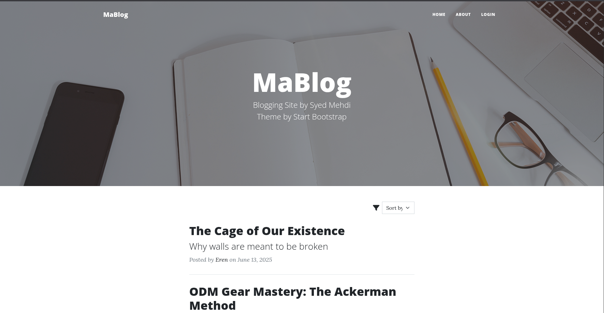
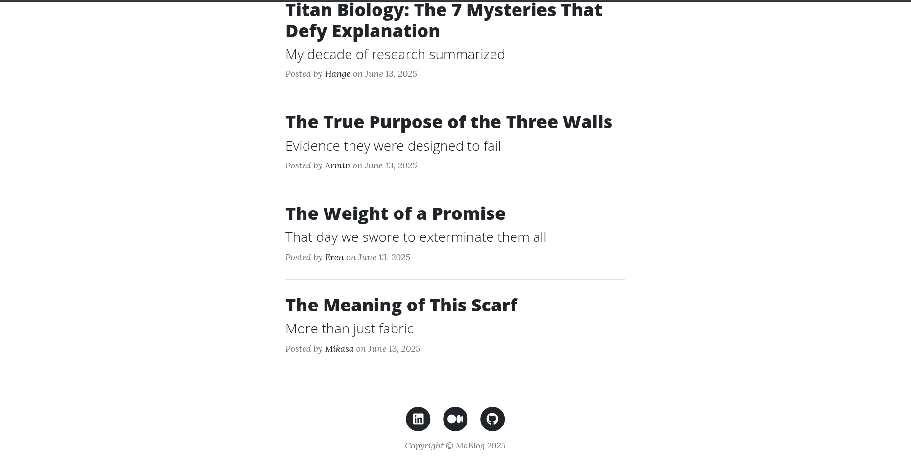
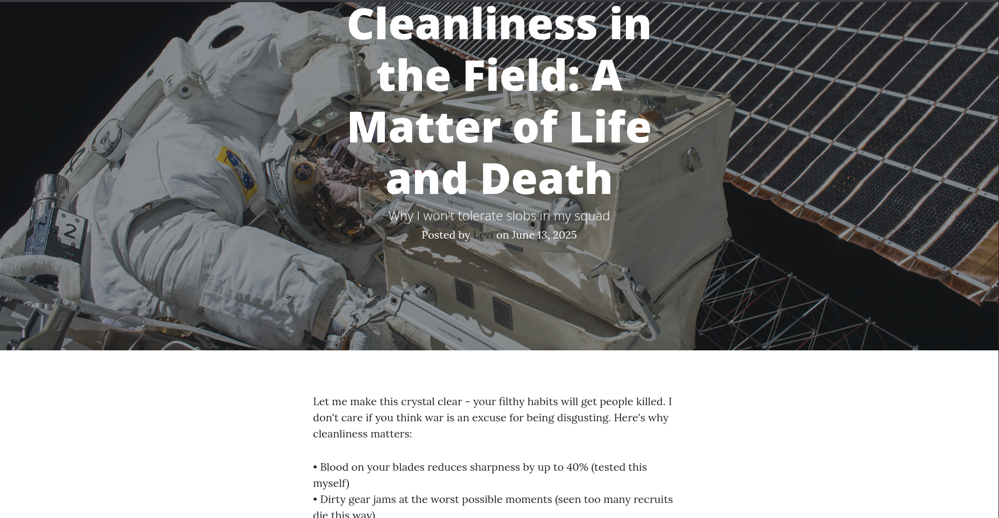
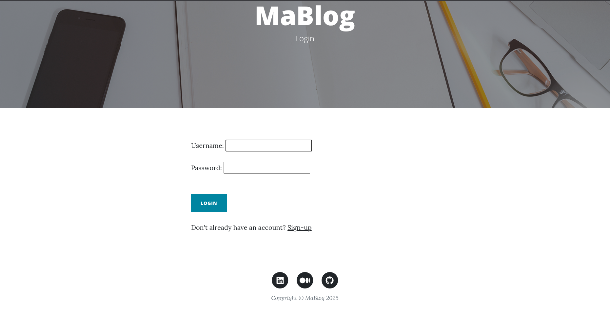
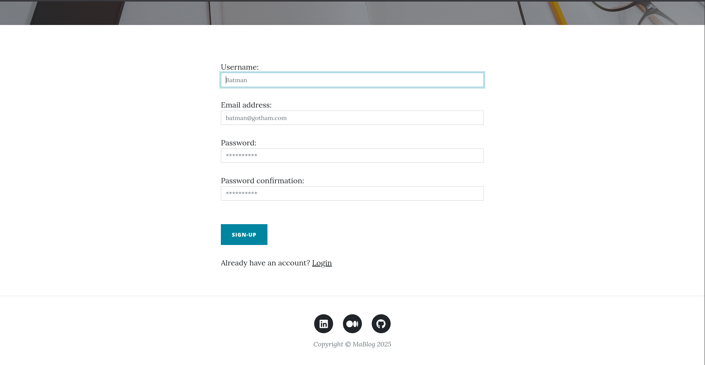
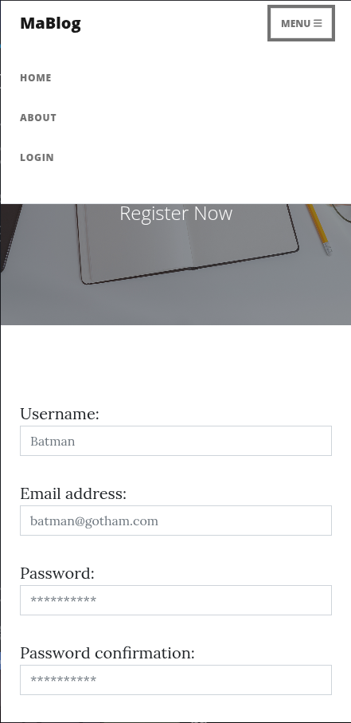

# MaBlog - A Blogging Platform

I built this project to learn Django framework. I've implemented basic CRUD functionality for blog posts and used django templates for rendering them. And the front-end is taken from Start Bootstrap templates.

## Features

  

### User Authentication

- Sign-up, log in and log out. Built custom forms, however, you can do the same using the admin panel.

### Blog Post Management

- Create, read, update, and delete posts.
- Filter posts using basic filters.
- Protecting blog posts from unauthorized access.

## Installation & Setup
 
- Download or clone the repository.
- Once inside the project folder, create & activate a virtual environment:

    ```python3 -m venv venv; source venv/bin/activate```
- cd into the project folder, and install the required packages:

    ```pip install -r requirements.txt```
- Run these commands to migrate your database:

    ```python manage.py makemigrations; python manage.py migrate```
- Create a superuser (it'll ask you for email and password):

    ```python manage.py createsuperuser```
- setup_db.txt contains code to populate the database, we'll use django shell:

    ```python manage.py shell```
- Now, copy and paste all the code from setup_db.txt file to django shell. This wil make sure our database doesn't feel empty. Feel free to tinker with the setup_db.txt.
- Finally, start the server:

    ```python manage.py runserver```
- Go to http://127.0.0.1:8000/






